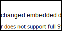

# tstrickland-docs-sandbox
An area for me to play with documentation

## An embedded diagram

<a href="https://app.diagrams.net/#Uhttps%3A%2F%2Fraw.githubusercontent.com%2Fch-tstrickland%2Ftstrickland-docs-sandbox%2Fmaster%2Fassets%2Fembedded-1.svg" target="_blank">NewEdit</a>

<a href="http://jgraph.github.io/drawio-github/edit-diagram.html?repo=ch-tstrickland/tstrickland-docs-sandbox&path=assets/embedded-1.svg" target="_blank">Edit</a> | <a href="https://app.diagrams.net/#Uhttps://app.diagrams.net/#Uhttps%3A%2F%2Fraw.githubusercontent.com%2Fch-tstrickland%2Ftstrickland-docs-sandbox%2Fmaster%2Fassets%2Fembedded-1.svg" target="_blank">Edit As New</a> | <a href="https://app.diagrams.net/#Hjgraph%2Fch-tstrickland%2Ftstrickland-docs-sandbox%2Fmaster%2Fassets%2Fembedded-1.svg" target="_blank">Edit in diagrams.net</a>
